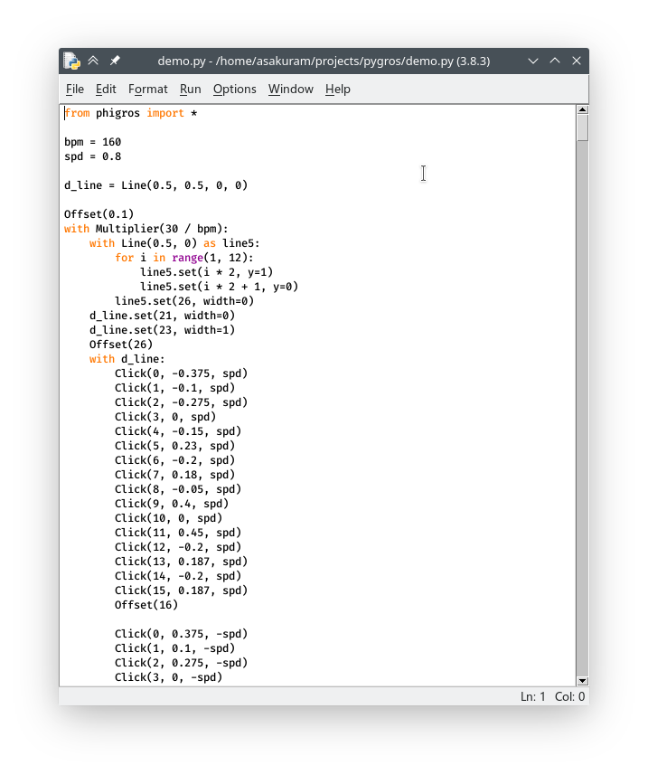
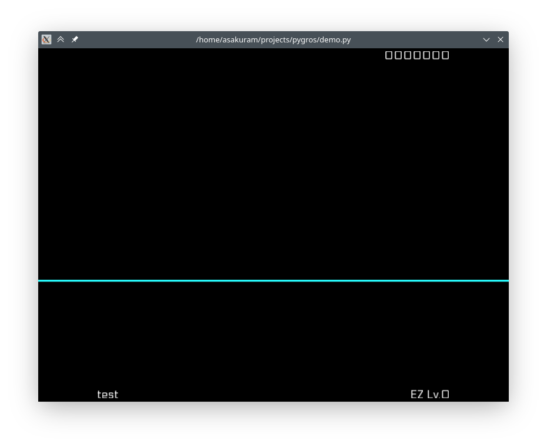

# 运行演示谱面

解压后，打开解压得到的 `pygros-master` 文件夹，里面有一个 `demo.py` 文件。

双击打开 `demo.py` 文件，你应该会看到类似这样的窗口：

按键盘上的 `F5` 运行这个程序。如果一切正常，你应该会看到这样一个窗口：

没错这个就是你们在B站上看到的[那个](https://www.bilibili.com/video/bv1zK4y1t7Wi)（（（